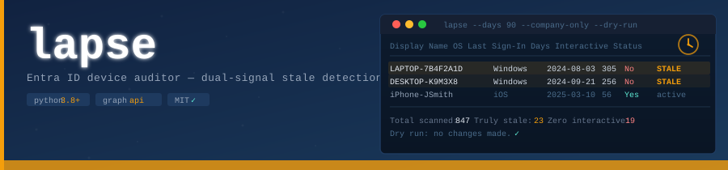
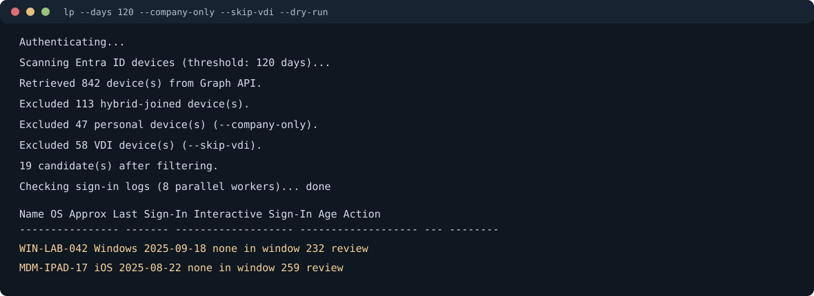
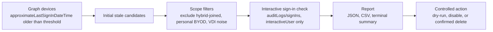

# lapse

Entra ID accumulates device objects silently. VDI pools register a new object every session. Offboarded employees leave phones and laptops in the directory for months. Eventually a user hits the device registration quota and gets blocked from Office 365 on a new laptop, but the directory evidence is hard to interpret.

The standard cleanup approach filters on `approximateLastSignInDateTime`. The problem is that property also updates on background sync traffic, Windows Update heartbeats, and MDM check-ins. A device untouched by a human for 18 months can still appear active. Naive filters produce hundreds of false positives and erode trust in the whole process.

lapse adds a second signal. For every candidate that fails the timestamp filter, it checks `auditLogs/signIns` for actual interactive user authentication within the same window. Background sync doesn't count. A device is only marked truly stale when both signals agree.


## Demo



More context is available in [docs/demo.md](docs/demo.md).

## What It Does

- Queries Graph API with a server-side `$filter` on `approximateLastSignInDateTime` to pull initial candidates.
- Cross-checks each candidate against `auditLogs/signIns` filtered to `interactiveUser` events — the secondary verification that eliminates false positives.
- Excludes hybrid-joined (domain-joined) devices by default.
- `--company-only` excludes personal BYOD devices.
- `--skip-vdi` excludes non-persistent VDI registrations by name and enrollment profile.
- `--disable` sets `accountEnabled = false` — reversible, no deletion.
- `--delete` permanently removes stale devices, with a confirmation prompt unless `--force`.
- `--dry-run` produces a full report with no changes made.
- JSON and CSV output for review workflows and audit records.
- Parallel sign-in log checks via `concurrent.futures` to keep runtime reasonable on large tenants.
- `Retry-After` backoff on HTTP 429.
- Token cache persisted between runs; supports device code flow and client credentials.

## Decision Flow



The second signal is the point of the tool: a device is not treated as truly stale solely because background activity made one timestamp confusing.

## Required Permissions

Register an application in Entra ID and grant:

| Permission | Why |
|---|---|
| `Device.ReadWrite.All` | Read device list; disable or delete. |
| `Directory.Read.All` | Read directory properties. |
| `AuditLog.Read.All` | Read interactive sign-in logs for secondary verification. |

For read-only audits, `Device.Read.All` is sufficient.

## Usage

```bash
# Report only — no changes
lp --client-id <id> --tenant-id <tenant> -d 90 -n
lapse --client-id <id> --tenant-id <tenant> --days 90 --dry-run

# Filter to company-owned devices, skip VDI noise
lp --client-id <id> --tenant-id <tenant> --company-only --skip-vdi

# Write reports
lp --client-id <id> --tenant-id <tenant> -o results.json --output-csv results.csv

# Disable stale devices (reversible)
lp --client-id <id> --tenant-id <tenant> --disable

# Delete stale devices (confirm first with --dry-run)
lp --client-id <id> --tenant-id <tenant> --delete

# App-only for scheduled automation
export LAPSE_CLIENT_SECRET="<secret>"
lp --client-secret --client-id <id> --tenant-id <tenant> --client-secret-env LAPSE_CLIENT_SECRET --disable
```

PowerShell equivalent:

```powershell
$env:LAPSE_CLIENT_SECRET = "<secret>"
lp --client-secret --client-id <id> --tenant-id <tenant> --client-secret-env LAPSE_CLIENT_SECRET --disable
```

## Short Flags

| Short | Long | Description |
|---|---|---|
| `-d N` | `--days N` | Inactivity threshold in days |
| `-o FILE` | `--output FILE` | Write JSON report to FILE |
| `-q` | `--quiet` | Summary line only, no table |
| `-n` | `--dry-run` | Report without making changes |
| `-f` | `--force` | Skip confirmation prompt on `--delete` |
| `-w N` | `--workers N` | Parallel threads for sign-in checks |

## Secret Handling

Prefer `--client-secret-env` over `--client-secret-value` for scheduled runs so
the secret is not left in shell history or exposed in process listings. The
token cache may contain reusable authentication material; keep
`token_cache.bin` out of source control, store it in a restricted directory, and
delete or revoke it if it is exposed.

## Deployment Stages

Running `--delete` on day one is how cleanup tools create support tickets. The recommended path:

| Stage | Command | Checkpoint |
|---|---|---|
| Audit | `--dry-run` | Review for a week. Look for false positives. |
| Review | `--output-csv` | Human approves before any action. |
| Disable | `--disable` | Run two weeks. Confirm nothing legitimate is affected. |
| Purge | `--delete` | Schedule as weekly automation. |

## Installation

```bash
git clone https://github.com/srkyn/lapse.git
cd lapse
pip install .
lp --version
```

Or run directly:

```bash
pip install msal requests tabulate
python lapse.py --client-id <id> --tenant-id <tenant> --dry-run
```

## Files

- `lapse.py`: the scanner
- `docs/demo.md`: sanitized example output and interpretation
- `tests/test_lapse.py`: unit tests (37 cases)
- `docs/design-notes.md`: detection approach, design decisions, and limitations
- `CHANGELOG.md`: release history

## Limitations

- Sign-in log retention depends on Entra ID license tier; short retention windows reduce secondary verification accuracy.
- Does not inspect device software or Intune compliance state.
- Does not handle on-premises Active Directory.
- May miss devices in tenants where the current credentials lack read access to sign-in logs.

## Testing

```bash
python -m py_compile lapse.py
python -m unittest discover -s tests -v
lp --version
```
